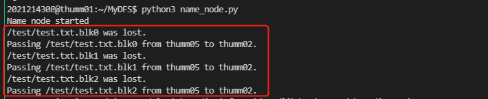
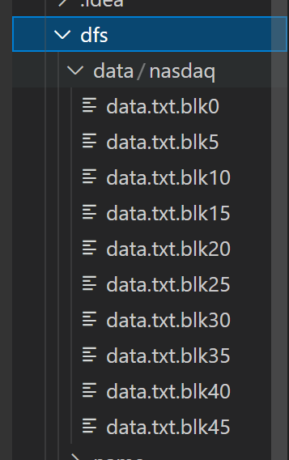
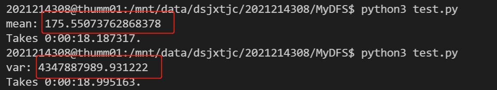
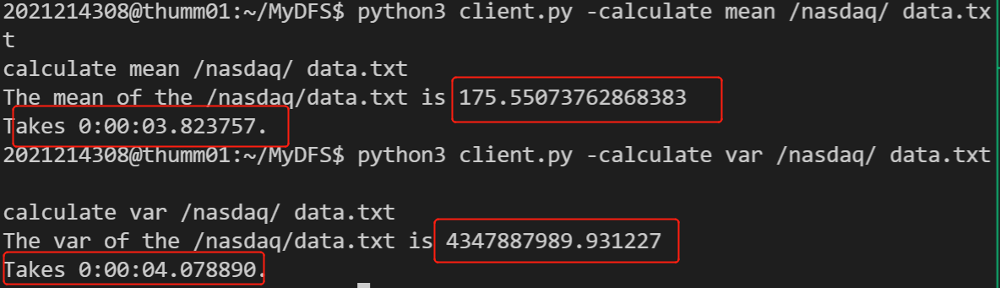

# 实验二：Hadoop并行编程

## 一、实验目标

本次实验旨在帮助学生补全一个简单的Distributed File System (DFS) 并在其上实现MapReduce框架。具体任务如下：

* 了解 Hadoop 分布式文件系统常用指令；
* 补全一个简单的分布式文件系统并添加容错功能；
* 在自己设计的分布式文件系统上实现MapReduce 框架（5 分）。


## 二、掌握Hadoop DFS常用指令

### 1. Hadoop使用方法

首先查看Hadoop DFS 支持的指令：


使用`ls` 指令查看DFS 中根目录下文件/文件夹的信息：


查看自己的文件下的内容：


在本地创建一个`test.txt` 文件：


将本地文件传输至DFS 中：


可以看到文件以及传输到DFS 上。`copyFromLocal/copyToLocal `用于本地文件系统与DFS之间文件的复制，`moveFromLocal/moveToLocal` 用于本地文件系统与DFS 之间文件的移动。


查看`copyFromLocal `的用法，可以看到该指令有两个必填参数，第一个参数是本地路径，第二个参数是DFS 路径：


### 2. 通过Web 查看Hadoop 运行情况

在本地运行如下命令（将服务器的9870 端口映射到本地的9870 端口）：


在本地的浏览器中输入`localhost:9870` 打开9870 端口，即可查看hadoop 运行情况，可通过此界面查看hadoop 的一些基本参数和job/task 的完成情况。


## 三、分布式文件系统

### 2. copyToLocal

`copyToLocal`是`copyFromLocal`的反向操作，从NameNode获取一张FAT表；打印FAT表；根据FAT表逐个从目标DataNode请求数据块，写入到本地文件中：

```python
def copyToLocal(self, dfs_path, local_path):
    request = "get_fat_item {}".format(dfs_path)
    print("Request: {}".format(request))
    # TODO: 从NameNode获取一张FAT表；打印FAT表；根据FAT表逐个从目标DataNode请求数据块，写入到本地文件中

    # 从NameNode获取一张FAT表
    self.name_node_sock.send(bytes(request, encoding='utf-8'))
    fat_pd = self.name_node_sock.recv(BUF_SIZE)

    # 打印FAT表，并使用pandas读取
    fat_pd = str(fat_pd, encoding='utf-8')
    print("Fat: \n{}".format(fat_pd))
    fat = pd.read_csv(StringIO(fat_pd))

    # 根据FAT表逐个从目标DataNode请求数据块，而后将收到的数据块写入到本地文件中
    fp = open(local_path, "w")
    for idx, row in fat.iterrows():
        data_node_sock = socket.socket()
        data_node_sock.connect((row['host_name'], data_node_port))
        blk_path = dfs_path + ".blk{}".format(row['blk_no'])

        request = "load {}".format(blk_path)
        data_node_sock.send(bytes(request, encoding='utf-8'))
        time.sleep(0.2)  # 两次传输需要间隔一段时间，避免粘包
        data = data_node_sock.recv(BUF_SIZE)
        data = str(data, encoding='utf-8')
        fp.write(data)
        data_node_sock.close()
        fp.close()
```

测试结果：


### 3. ls

Client 会向NameNode 发送请求，查看`dfs_path`下的文件或文件夹信息。向NameNode发送请求，查看dfs_path下文件或者文件夹信息。

```python
def ls(self, dfs_path):
    # TODO: 向NameNode发送请求，查看dfs_path下文件或者文件夹信息
    # 向NameNode发送请求，查看dfs_path下文件或者文件夹信息
    try:
        cmd = "ls {}".format(dfs_path)
        self.name_node_sock.send(bytes(cmd, encoding='utf-8'))
        response_msg = self.name_node_sock.recv(BUF_SIZE)
        print(str(response_msg, encoding='utf-8'))
    except Exception as e:
        print(e)
    finally:
        pass
```

测试结果：


### 4. rm

`rm`则是要删除相应路径的文件。从NameNode获取改文件的FAT表，获取后删除；打印FAT表；根据FAT表逐个告诉目标DataNode删除对应数据块。

```python
def rm(self, dfs_path):
    request = "rm_fat_item {}".format(dfs_path)
    print("Request: {}".format(request))
    # TODO: 从NameNode获取改文件的FAT表，获取后删除；打印FAT表；根据FAT表逐个告诉目标DataNode删除对应数据块
    # 从NameNode获取改文件的FAT表，获取后删除
    self.name_node_sock.send(bytes(request, encoding='utf-8'))
    fat_pd = self.name_node_sock.recv(BUF_SIZE)

    # 打印FAT表，并使用pandas读取
    fat_pd = str(fat_pd, encoding='utf-8')
    print("Fat: \n{}".format(fat_pd))
    fat = pd.read_csv(StringIO(fat_pd))

    # 根据FAT表逐个告诉目标DataNode删除对应数据块
    for idx, row in fat.iterrows():
        data_node_sock = socket.socket()
        data_node_sock.connect((row['host_name'], data_node_port))
        blk_path = dfs_path + ".blk{}".format(row['blk_no'])

        request = "rm {}".format(blk_path)
        data_node_sock.send(bytes(request, encoding='utf-8'))
        response_msg = data_node_sock.recv(BUF_SIZE)
        print(response_msg)
        data_node_sock.close()
```

测试结果：


### 5. data replication

修改后的common.py：

```python
dfs_replication = 3
dfs_blk_size = 4096  # * 1024

# NameNode和DataNode数据存放位置
name_node_dir = "./dfs/name"
data_node_dir = "./dfs/data"

data_node_port = 11009  # DataNode程序监听端口
name_node_port = 21009  # NameNode监听端口

# 集群中的主机列表
host_list = ['thumm01', 'thumm02', 'thumm03', 'thumm04', 'thumm05', 'thumm06']
name_node_host = "thumm01"

BUF_SIZE = dfs_blk_size * 2
```


修改了namenode.py中的`new_fat_item`，使其可以针对多个副本，每次随机选取N个host来写入当前块（N为`dfs_replication`）

```python
def new_fat_item(self, dfs_path, file_size):
    nb_blks = int(math.ceil(file_size / dfs_blk_size))
    print(file_size, nb_blks)

    # todo 如果dfs_replication为复数时可以新增host_name的数目
    data_pd = pd.DataFrame(columns=['blk_no', 'host_name', 'blk_size'])

    for i in range(nb_blks):
        if dfs_replication == 1:
            blk_no = i
            host_name = np.random.choice(host_list, size=dfs_replication, replace=False)[0]
            blk_size = min(dfs_blk_size, file_size - i * dfs_blk_size)
            data_pd.loc[i] = [blk_no, host_name, blk_size]
        else:  # 针对需要些多个副本的情况
            blk_no = i
            host_name_list = np.random.choice(host_list, size=dfs_replication, replace=False)
            blk_size = min(dfs_blk_size, file_size - i * dfs_blk_size)
            for j in range(dfs_replication):    # 每次随机选取N个host来写入当前块（N为dfs_replication）
                host_name = host_name_list[j]
                data_pd.loc[(i - 1) * dfs_replication + j] = [blk_no, host_name, blk_size]

    # 获取本地路径
    local_path = name_node_dir + dfs_path

    # 若目录不存在则创建新目录
    os.system("mkdir -p {}".format(os.path.dirname(local_path)))
    # 保存FAT表为CSV文件
    data_pd.to_csv(local_path, index=False)
    # 同时返回CSV内容到请求节点
    return data_pd.to_csv(index=False)
```


修改了client.py中的`copyFromLocal`，针对多次写入修改了循环：

```python
def copyFromLocal(self, local_path, dfs_path):
    file_size = os.path.getsize(local_path)
    print("File size: {}".format(file_size))

    request = "new_fat_item {} {}".format(dfs_path, file_size)
    print("Request: {}".format(request))

    # 从NameNode获取一张FAT表
    self.name_node_sock.send(bytes(request, encoding='utf-8'))
    fat_pd = self.name_node_sock.recv(BUF_SIZE)

    # 打印FAT表，并使用pandas读取
    fat_pd = str(fat_pd, encoding='utf-8')
    print("Fat: \n{}".format(fat_pd))
    fat = pd.read_csv(StringIO(fat_pd))

    # 根据FAT表逐个向目标DataNode发送数据块
    fp = open(local_path)

    global data_last
    counter = 0

    # 针对多次写入修改了循环
    for idx, row in fat.iterrows():
        if counter == 0:
            data = fp.read(int(row['blk_size']))
        else:
            data = data_last
        data_node_sock = socket.socket()
        data_node_sock.connect((row['host_name'], data_node_port))
        blk_path = dfs_path + ".blk{}".format(row['blk_no'])

        request = "store {}".format(blk_path)
        data_node_sock.send(bytes(request, encoding='utf-8'))
        time.sleep(0.2)  # 两次传输需要间隔一段时间，避免粘包
        data_node_sock.send(bytes(data, encoding='utf-8'))
        data_node_sock.close()
        data_last = data
        counter = (counter+1) % dfs_replication
    fp.close()
```


**测试结果**（仅展示thumm01和thumm02上的data_node情况，其它几个节点类似，故不多赘述）：

thumm01：


thumm02：


### 6. HeartBeat

首先，修改name_node.py中的`run`函数，添加一个线程，用该线程检测是否有服务器挂掉：

```python
def run(self):  # 启动NameNode
    # 创建一个监听的socket
    listen_fd = socket.socket()
    try:
        # 监听端口
        listen_fd.bind(("0.0.0.0", name_node_port))
        listen_fd.listen(5)
        print("Name node started")
        # 添加线程，用该线程检测是否有服务器挂掉
        t = threading.Thread(target=self.heart_beat)
        t.start()
        while True:
            # 等待连接，连接后返回通信用的套接字
            sock_fd, addr = listen_fd.accept()
            print("connected by {}".format(addr))

            try:
                # 获取请求方发送的指令
                request = str(sock_fd.recv(128), encoding='utf-8')
                request = request.split()  # 指令之间使用空白符分割
                print("Request: {}".format(request))

                cmd = request[0]  # 指令第一个为指令类型

                if cmd == "ls":  # 若指令类型为ls, 则返回DFS上对于文件、文件夹的内容
                    dfs_path = request[1]  # 指令第二个参数为DFS目标地址
                    response = self.ls(dfs_path)
                elif cmd == "get_fat_item":  # 指令类型为获取FAT表项
                    dfs_path = request[1]  # 指令第二个参数为DFS目标地址
                    response = self.get_fat_item(dfs_path)
                elif cmd == "new_fat_item":  # 指令类型为新建FAT表项
                    dfs_path = request[1]  # 指令第二个参数为DFS目标地址
                    file_size = int(request[2])
                    response = self.new_fat_item(dfs_path, file_size)
                elif cmd == "rm_fat_item":  # 指令类型为删除FAT表项
                    dfs_path = request[1]  # 指令第二个参数为DFS目标地址
                    response = self.rm_fat_item(dfs_path)
                elif cmd == "format":
                    response = self.format()
                else:  # 其他位置指令
                    response = "Undefined command: " + " ".join(request)

                print("Response: {}".format(response))
                sock_fd.send(bytes(response, encoding='utf-8'))
            except KeyboardInterrupt:  # 如果运行时按Ctrl+C则退出程序
                break
            except Exception as e:  # 如果出错则打印错误信息
                print(e)
            finally:
                sock_fd.close()  # 释放连接
    except KeyboardInterrupt:  # 如果运行时按Ctrl+C则退出程序
        pass
    except Exception as e:  # 如果出错则打印错误信息
        print(e)
    finally:
        listen_fd.close()  # 释放连接
```


而后，我们在name_node.py中添加`heart_beat`函数，模拟heart_beat操作。它每隔一段时间轮询一遍所有服务器，查询是否有服务器挂掉。我们通过连接后发送 ping 命令，来轮询服务器；如果发生服务器挂掉的情况，则启动修复机制，对丢失的文件进行备份，保证data_replication不变。

```python
# 模拟heart_beat操作。
def heart_beat(self):
    time.sleep(5)
    while True:   # 每隔一段时间轮询一遍所有服务器，查询是否有服务器挂掉
        for hostname in host_list:
            data_node_sock = socket.socket()
            try:
                # 通过连接后发送 ping 命令，来轮询服务器
                data_node_sock.connect((hostname, data_node_port))
                data_node_sock.send(bytes("ping", encoding='utf-8'))
            except BaseException:
                # 如果发生服务器挂掉的情况，则启动修复机制，对丢失的文件进行备份，保证data_replication不变
                print(hostname + " disconnect!")
                host_list.remove(hostname)
                self.repair(hostname, '/')
                continue
            time.sleep(0.2)
            data_node_sock.close()
            # print(hostname + ": Normal.")
        time.sleep(5)
```


此外，我们在name_node.py中添加`repair`函数，它遍历NameNode目录下的所有fat表，针对每个fat表进行修复：

```python
# 遍历NameNode目录下的所有fat表，针对每个fat表进行修复
def repair(self, host_name, dfs_dir):
    dir = name_node_dir + dfs_dir
    all_list = os.listdir(dir)
    for item in all_list:
        path = os.path.join(dir, item)
        if os.path.isfile(path):
            self.repair_item(host_name, dfs_dir + '/' + item)
        else:
            self.repair(host_name, dfs_dir + item)
```


最后，我们在name_node.py中添加`repair_item`函数，它根据fat表对具体的某个丢失的文件进行备份，保证data_replication不变。首先，它扫描寻找丢失块，并加以记录；而后，它寻找可以使用的备份服务器，从包含缺失数据块的服务器中拷贝一份放到备份服务器中，并修改FAT表的内容：

```python
# 对具体的某个丢失的文件（根据fat表）进行备份，保证data_replication不变
def repair_item(self, host_name, dfs_path):
    local_path = name_node_dir + dfs_path
    fat = pd.read_csv(local_path)

    blk_dic = {}
    lost_blk = []

    # 扫描寻找丢失块，并加以记录
    for idx, row in fat.iterrows():
        block_num = row['blk_no']
        host = row['host_name']
        if str(block_num) in blk_dic.keys():
            if host != host_name:
                blk_dic[str(block_num)].append(host)
        else:
            blk_dic[str(block_num)] = [host]
        if host == host_name:
            lost_blk.append(block_num)

    # 对每一个丢失的块进行修复
    for block in lost_blk:
        temp_host_list = host_list.copy()

        # 寻找可以使用的备份服务器
        for host in blk_dic[str(block)]:
            temp_host_list.remove(host)
        recover_host = np.random.choice(temp_host_list, size=1, replace=False)[0]
        info_host = np.random.choice(blk_dic[str(block)], size=1, replace=False)[0]

        # 从包含缺失数据块的服务器中拷贝一份放到备份服务器中
        # 拷贝数据块
        recv_data_node_sock = socket.socket()
        recv_data_node_sock.connect((info_host, data_node_port))
        blk_path = dfs_path + ".blk{}".format(block)
        request = "load {}".format(blk_path)
        recv_data_node_sock.send(bytes(request, encoding='utf-8'))
        time.sleep(0.2)  # 两次传输需要间隔一段时间，避免粘包
        data = recv_data_node_sock.recv(BUF_SIZE)
        data = str(data, encoding='utf-8')
        recv_data_node_sock.close()

        # 存放到备份服务器中
        push_data_node_sock = socket.socket()
        push_data_node_sock.connect((recover_host, data_node_port))
        request = "store {}".format(blk_path)
        push_data_node_sock.send(bytes(request, encoding='utf-8'))
        time.sleep(0.2)  # 两次传输需要间隔一段时间，避免粘包
        push_data_node_sock.send(bytes(data, encoding='utf-8'))
        push_data_node_sock.close()

        print("{} was lost.".format(blk_path))
        print("Passing {} from {} to {}.".format(blk_path, info_host, recover_host))

        # 修改FAT表的内容
        fat.loc[(fat['host_name'] == host_name) & (fat['blk_no'] == block), 'host_name'] = recover_host
        fat.to_csv(local_path, index=False)
```


**测试结果**

关闭thumm05：


Name_node检测出thumm05断开，开启修复机制：


其它的节点在该过程中同时接收ping消息以及备份时的传送消息：


#### 6.1 Bonus

额外的容错功能，数据丢失检验：在服务器都保持正常的情况下（不出现挂掉的情况），系统也会自动检查维护数据块，检验是否有数据块的丢失。

首先，修改name_node.py中的`run`函数，添加一个线程，用该线程检测是否有数据丢失：

```python
def run(self):  # 启动NameNode
    # 创建一个监听的socket
    listen_fd = socket.socket()
    try:
        # 监听端口
        listen_fd.bind(("0.0.0.0", name_node_port))
        listen_fd.listen(5)
        print("Name node started")
        # 添加线程，用该线程检测是否有服务器挂掉
        t = threading.Thread(target=self.heart_beat)
        t.start()
        # 添加线程，用该线程检测是否有数据丢失
        t2 = threading.Thread(target=self.data_loss_check)
        t2.start()

        while True:
            # 等待连接，连接后返回通信用的套接字
            sock_fd, addr = listen_fd.accept()
            print("connected by {}".format(addr))

            try:
                # 获取请求方发送的指令
                request = str(sock_fd.recv(128), encoding='utf-8')
                request = request.split()  # 指令之间使用空白符分割
                print("Request: {}".format(request))

                cmd = request[0]  # 指令第一个为指令类型

                if cmd == "ls":  # 若指令类型为ls, 则返回DFS上对于文件、文件夹的内容
                    dfs_path = request[1]  # 指令第二个参数为DFS目标地址
                    response = self.ls(dfs_path)
                elif cmd == "get_fat_item":  # 指令类型为获取FAT表项
                    dfs_path = request[1]  # 指令第二个参数为DFS目标地址
                    response = self.get_fat_item(dfs_path)
                elif cmd == "new_fat_item":  # 指令类型为新建FAT表项
                    dfs_path = request[1]  # 指令第二个参数为DFS目标地址
                    file_size = int(request[2])
                    response = self.new_fat_item(dfs_path, file_size)
                elif cmd == "rm_fat_item":  # 指令类型为删除FAT表项
                    dfs_path = request[1]  # 指令第二个参数为DFS目标地址
                    response = self.rm_fat_item(dfs_path)
                elif cmd == "format":
                    response = self.format()
                else:  # 其他位置指令
                    response = "Undefined command: " + " ".join(request)

                print("Response: {}".format(response))
                sock_fd.send(bytes(response, encoding='utf-8'))
            except KeyboardInterrupt:  # 如果运行时按Ctrl+C则退出程序
                break
            except Exception as e:  # 如果出错则打印错误信息
                print(e)
            finally:
                sock_fd.close()  # 释放连接
    except KeyboardInterrupt:  # 如果运行时按Ctrl+C则退出程序
        pass
    except Exception as e:  # 如果出错则打印错误信息
        print(e)
    finally:
        listen_fd.close()  # 释放连接
```


而后，在name_node.py中添加`data_loss_check`函数，检测是否有文件块丢失：

```python
# 检测是否有文件块丢失
def data_loss_check(self):
    time.sleep(20)
    while True:
        self.check_dfs("/")  # 开始检查目录下的所有文件
        time.sleep(20)
```


我们在name_node.py中添加`check_dfs`函数，模拟一次检测操作，NameNode检测目录下的所有文件，查看是否存在缺失的情况。我们通过遍历NameNode目录下的所有fat表，检查每个fat表里对应的数据块来实现：

```python
# 模拟一次检测操作，NameNode检测目录下的所有文件，查看是否存在缺失的情况
def check_dfs(self, dfs_dir):
    dir = name_node_dir + dfs_dir
    all_list = os.listdir(dir)
    # 遍历NameNode目录下的所有fat表，检查每个fat表里对应的数据块
    for item in all_list:
        path = os.path.join(dir, item)
        if os.path.isfile(path):
            self.checkout_item(dfs_dir + '/' + item)
        else:
            self.check_dfs(dfs_dir + item)
```


针对每一个fat表，我们在我们在name_node.py中添加`checkout_item`函数，检查某个fat表下的所有数据是否正常，如出现异常则进行修复：

```python
# 检查某个fat表下的所有数据是否正常，如出现异常则进行修复
def checkout_item(self, dfs_path):
    local_path = name_node_dir + dfs_path
    fat = pd.read_csv(local_path)
    # 检查每一条数据块是否存在
    for idx, row in fat.iterrows():
        data_node_sock = socket.socket()
        data_node_sock.connect((row['host_name'], data_node_port))
        blk_path = dfs_path + ".blk{}".format(row['blk_no'])
        request = "check {}".format(blk_path)
        data_node_sock.send(bytes(request, encoding='utf-8'))
        response_msg = str(data_node_sock.recv(BUF_SIZE), encoding='utf-8')
        data_node_sock.close()

        if response_msg == 'Normal':  # 正常情况
            continue
        else:  # 数据块发生丢失的情况，进行相关的恢复工作
            print("{} was lost.".format(blk_path))

            # 寻找包含数据块的服务器
            choice_list = fat[fat['blk_no'] == row['blk_no']]['host_name']
            for i in range(choice_list.size):
                info_host = choice_list.iloc[i]
                if info_host != row['host_name']:
                    break

            # 从包含缺失数据块的服务器中拷贝一份放到备份服务器中
            recv_data_node_sock = socket.socket()
            recv_data_node_sock.connect((info_host, data_node_port))
            request = "load {}".format(blk_path)
            recv_data_node_sock.send(bytes(request, encoding='utf-8'))
            time.sleep(0.2)  # 两次传输需要间隔一段时间，避免粘包
            data = recv_data_node_sock.recv(BUF_SIZE)
            data = str(data, encoding='utf-8')
            recv_data_node_sock.close()

            # 存放到丢失数据块服务器中
            push_data_node_sock = socket.socket()
            push_data_node_sock.connect((row['host_name'], data_node_port))
            request = "store {}".format(blk_path)
            push_data_node_sock.send(bytes(request, encoding='utf-8'))
            time.sleep(0.2)  # 两次传输需要间隔一段时间，避免粘包
            push_data_node_sock.send(bytes(data, encoding='utf-8'))
            push_data_node_sock.close()

            print("Passing {} from {} to {}.".format(blk_path, info_host, row['host_name']))
```


此外，我们还在data_node.py中添加了check的指令，以检测本地的数据块是否丢失：

```python
# check指令，用于检测本地的数据块是否丢失
def check(self, dfs_path):
    # 本地路径
    local_path = data_node_dir + dfs_path
    if os.path.exists(local_path):
        return "Normal"
    else:
        return "Disappear"
```


**测试结果**

在这里，我们同时开启宕机检测与数据块丢失检测。

首先，模拟数据块丢失：


Name Node检测到数据块丢失，并启动恢复：



Data Node上的情况：


## 四、MapReduce

#### 数据集

我们在实验一种为计算均值、方差准备了*AMEX, NYSE, NASDAQ stock histories*数据集。数据集大小为**2.9GB**，存储目录为**/home/dsjxtjc/2021214308/datasets/nasdaq_stock**。其包含了AMEX, NYSE, NASDAQ等多个证券交易所的股票历史信息。

首先，针对实验一中准备的美股信息数据集进行预处理，使用preprocess_dataset.py将数值信息从csv文件中读出，并保存于data.txt文件中：

```python
import pandas as pd
import os

dataset_dir = "/home/dsjxtjc/2021214308/datasets/nasdaq_stock/full_history/"
dst_dir = "/home/dsjxtjc/2021214308/MyDFS/test/data.txt"
all_list = os.listdir(dataset_dir)
f = open(dst_dir, "w")
counter = 0

for item in all_list:
    local_path = dataset_dir + item
    csv_file = pd.read_csv(local_path)
    csv_file = csv_file['open']
    for i in range(csv_file.size):
        f.write(str(csv_file.iloc[i]) + "\n")
    counter = counter + 1
    print("{} already processed. {}/{}".format(item, counter, len(all_list)))
```


#### **数据分割方案**

我们使用前文所述的-copyFromLocal命令将数据存储到dfs上，并在此过程中进行数据分割。

- 关于数据分割，我们在此处的分割目的是尽可能地使各个服务器上存储的数据负载均衡，这样在计算均值以及方差时各个服务器间计算时间基本一致，尽可能减少额外的等待时间。
- 此外，由于我们的数据是，若直接按原有的分块方式，会导致元数据被截断的问题。为了解决这个问题，我们使用行来分割数据，计算每一行数据的平均大小、每一个数据块中平均的行数，进而推出需要划分成多少块。

我们修改name_node.py中的`new_fat_item`函数，创建了一个新函数`new_fat_item_lines`。计算每一行数据的平均大小、每一个数据块中平均的行数，进而推出需要划分成多少块；为了负载均衡，我们在分发数据块时，每次轮流给每个节点分发数据块：

```python
# 按行划分传输文件
def new_fat_item_lines(self, dfs_path, file_size, line_number):
    # 计算每一行文件占用的大小
    line_avg_size = int(math.ceil(file_size / line_number))
    # 计算每个blk中平均的行数
    lines_per_blk = int(math.floor(big_dfs_blk_size / line_avg_size))

    number_blks = int(math.ceil(line_number / lines_per_blk))

    print(file_size, line_number, line_avg_size, lines_per_blk)

    data_pd = pd.DataFrame(columns=['blk_no', 'host_name', 'blk_size'])

    counter = 0
    for i in range(number_blks):
        blk_no = i
        # 为了负载均衡，每次轮流给每个节点分发数据
        host_name = host_list[counter]
        counter = (counter + 1) % len(host_list)
        blk_size = min(lines_per_blk * line_avg_size,
                       line_number * line_avg_size - i * lines_per_blk * line_avg_size)
        data_pd.loc[i] = [blk_no, host_name, blk_size]

    # 获取本地路径
    local_path = name_node_dir + dfs_path
    # 若目录不存在则创建新目录
    os.system("mkdir -p {}".format(os.path.dirname(local_path)))
    # 保存FAT表为CSV文件
    data_pd.to_csv(local_path, index=False)
    # 同时返回CSV内容到请求节点
    return data_pd.to_csv(index=False)
```

我们在client.py中，修改`copyFromLocal`函数，创建了一个新函数`copyFromLocalLines`，我们使用行来分割数据块；并且，为了传输地更加高效，我们使用scp命令来传输大文件（相关的文件夹需要提前建好，否则会报错）：

```python
# 按行划分传输文件
def copyFromLocalLines(self, local_path, dfs_path):
    file_size = os.path.getsize(local_path)
    # 计算每个文件的行数
    line_number = int(os.popen('cat {} | wc -l'.format(local_path)).read())
    print("File size: {}".format(file_size))
    print("File lines: {:d}".format(line_number))

    # 计算每行的平均占用尺寸
    line_avg_size = int(math.ceil(file_size / line_number))

    # 每个blk里面的平均的行数
    lines_per_blk = int(math.floor(big_dfs_blk_size / line_avg_size))
    print("Lines per blk: {:d}".format(lines_per_blk))

    request = "new_fat_item {} {} {}".format(dfs_path, file_size, line_number)
    print("Request: {}".format(request))

    # 从NameNode获取一张FAT表
    self.name_node_sock.send(bytes(request, encoding='utf-8'))
    fat_pd = self.name_node_sock.recv(BUF_SIZE)

    # 打印FAT表，并使用pandas读取
    fat_pd = str(fat_pd, encoding='utf-8')
    print("Fat: \n{}".format(fat_pd))
    fat = pd.read_csv(StringIO(fat_pd))

    # 根据FAT表逐个向目标DataNode发送数据块
    temp_file = local_path + '_temp'    # 用于写拆分的小文件的temp_file
    with open(local_path, "r") as origin_file:
        line_counter = 0
        for idx, row in fat.iterrows():
            # 按行写拆分的小文件，避免存在元数据在划分过程中被截断
            depart_file = open(temp_file, "w")
            for line in origin_file:
                depart_file.write(line)
                line_counter = line_counter + 1
                if line_counter >= lines_per_blk:
                    depart_file.close()
                    line_counter = 0
                    break
            if depart_file:
                depart_file.close()
            # 使用scp传输大文件
            os.system("scp {} {}:{}{}.blk{}".format(temp_file, row['host_name'], "~/MyDFS/dfs/data",
                                                    dfs_path, row['blk_no']))
    os.remove(temp_file)
```

此外，由于数据集较大，进行分发所耗费的时间过长，我们修改了common.py中的一些配置，以加快分发的速度；我们新定义了大文件传输块大小`big_dfs_blk_size`，并且将`dfs_replication`调整为1：

```python
dfs_replication = 1
dfs_blk_size = 65536  # * 1024
big_dfs_blk_size = 8388608

# NameNode和DataNode数据存放位置
name_node_dir = "./dfs/name"
data_node_dir = "./dfs/data"

data_node_port = 4308  # DataNode程序监听端口
name_node_port = 14308  # NameNode监听端口

# 集群中的主机列表
host_list = ['thumm01', 'thumm02', 'thumm03', 'thumm04', 'thumm05']
name_node_host = "thumm01"

BUF_SIZE = dfs_blk_size * 100
```


#### 任务分配

MapReduce的Paper中，作者发现，大多数计算都可以拆分成Map, Shuffle, Reduce三个阶段：

- Map阶段中，每台机器先处理本机上的数据。
- 各个机器处理完自己的数据后，我们再把他们的结果汇总，这就是Shuffle阶段。
- 最后，进行最后一步处理，这就是Reduce。

在本次任务中，我们所需要计算的是均值与方差，所需的结果文件相对较小，因此我们将Name Node作为reducer，Data Node作为mapper。

具体的执行框架上，Name Node接收到计算的消息后，调用多线程，同时向多个服务器发送计算的消息；多个服务器（Data Node）在本地完成计算后，将数据传输回Name Node，Name Node开启的多个线程收集多个服务器map出的值；最后，Name Node调用reducer整合数据，获得最终的整体数据。name_node.py中的`calculte`函数负责执行这一整体框架：

```python
# 负责计算均值或方差的命令文件，负责接收命令，调用计算，返回相关数据
def calculte(self, option, dfs_path, filename):
    thread_list = []
    # 调用多线程，同时向多个服务器发送计算的消息
    for host in host_list:
        t = MyThread(self.calculate_comunicater, args=(option, dfs_path, filename, host))
        thread_list.append(t)
        t.start()
    map_list = []
    # 开启的多个线程收集多个服务器map出的值
    for t in thread_list:
        t.join()
        if option == "var":
            length, mean, var = t.get_result()
            map_list.append((length, mean, var))
        elif option == "mean":
            length, mean = t.get_result()
            map_list.append((length, mean))
    # 调用reducer整合数据，获得最终的整体数据
    result = self.reducer(option, map_list)
    return str(result)
```

我们使用name_node.py中的`calculate_comunicater`函数作为多线程函数，与各个服务器间进行通信，分配任务并收集计算出的值：

```python
# 多线程函数，负责与各个服务器进行通信
def calculate_comunicater(self, option, dfs_path, filename, host_name):
    # 发送计算指令
    data_node_sock = socket.socket()
    data_node_sock.connect((host_name, data_node_port))
    request = "map {} {} {}".format(option, dfs_path, filename)
    data_node_sock.send(bytes(request, encoding='utf-8'))
    # 接收服务器计算出的值
    response_msg = str(data_node_sock.recv(BUF_SIZE), encoding='utf-8')
    response = response_msg.split()
    if option == "var":
        length = int(response[0])
        mean = float(response[1])
        var = float(response[2])
        return length, mean, var
    elif option == "mean":
        length = int(response[0])
        mean = float(response[1])
        return length, mean
```

在每个服务器上，需要进行Map阶段，各自计算保存在其上的数据的均值与方差，我们使用data_node.py中的`mapper`函数来完成。我们使用正则表达式寻找符合条件的分块文件，对本服务器下所有的该文件的分块文件进行统计，计算均值或方差。

```python
# 在data_node上执行mapper操作
def mapper(self, dfs_path, filename, option):
    # 使用正则表达式寻找符合条件的分块文件
    read_format = re.compile(r"{}.(\w)*".format(filename))
    total_list = []

    # 对本服务器下所有的该文件的分块文件进行统计，计算均值或方差
    all_list = os.listdir(data_node_dir + dfs_path)
    for file in all_list:
        if not read_format.search(file) == None:
            read_file = read_format.search(file).group(0)
            read_dir = data_node_dir + dfs_path + read_file
            data_list = read_from_txt(read_dir)
            total_list.extend(data_list)

    # 均值无论是在求均值还是方差时都会用到，故必须计算
    # 如果操作是求方差，则额外求方差
    if option == "var":
        mean = np.mean(total_list)
        var = np.var(total_list)
        length = len(total_list)
        return "{} {} {}".format(length, mean, var)
    elif option == "mean":
        mean = np.mean(total_list)
        length = len(total_list)
        return "{} {}".format(length, mean)
```


#### 整合方案

每台服务器map出其各自的均值与方差后，我们需要进行整合得到最终的值，也就是Reduce阶段的操作。

我们可以使用增量计算均值与方差的方式，将各个服务器计算出的均值或方差转化为最终整体数据的均值与方差：

假设历史数据的均值为$\bar{H}$，方差为$\sigma_{H}^{2}$，增量数据的均值为$\bar{A}$，方差为$\sigma_{A}^{2}$，我们可以求得历史数据和增量数据的总均值$\bar{X}$与方差$\sigma^{2}$：
$$
\bar{X} = \frac{M\bar{H} + N\bar{A}}{M+N}
$$

$$
\sigma^{2} = \frac{M[\sigma_H^2 + M(\bar{X}- \bar{H})^2] + N[\sigma_A^2 + (\bar{X}-\bar{A})^2]}{M+N}
$$

我们通过name_node.py中的`reducer`函数来实现增量计算整合数据，得到最终整体数据的结果：

```python
# 整合数据，计算总的均值或方差
def reducer(self, option, map_list):
    avg = 0.0
    var_t = 0.0
    total_length = 0
    # 增量计算均值
    if option == "mean":
        for length, mean in map_list:
            avg = (avg * total_length + mean * length) / (total_length + length)
            total_length = total_length + length
        return avg
    # 增量计算方差
    elif option == "var":
        for length, mean, var in map_list:
            avg_new = (avg * total_length + mean * length) / (total_length + length)
            var_t = (total_length * (var_t + (avg_new - avg) ** 2) + length * (var + (avg_new - mean) ** 2)) /  (total_length + length)
            avg = avg_new
            total_length = total_length + length
        return var_t
```


#### 测试结果

数据分割：



在本地计算均值、方差：



使用MapReduce框架计算均值、方差：



可以看到：

- MapReduce框架计算出的均值与方差和本地计算的值基本一致，说明了本系统的稳定性。
- 除此之外，由于MapReduce框架使用的是多线程并发的分布式计算，最终计算大数据量的均值与方差的效率也要远高于在本地单台服务器计算。

