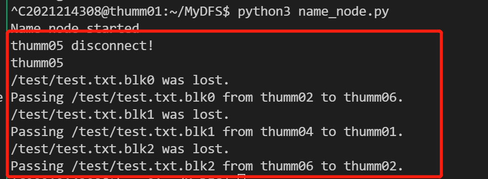

# 实验二：Hadoop并行编程

## 一、实验目标

本次实验旨在帮助学生补全一个简单的Distributed File System (DFS) 并在其上实现MapReduce框架。具体任务如下：

* 了解 Hadoop 分布式文件系统常用指令；
* 补全一个简单的分布式文件系统并添加容错功能；
* 在自己设计的分布式文件系统上实现MapReduce 框架（5 分）。


## 二、掌握Hadoop DFS常用指令

### 1. Hadoop使用方法

首先查看Hadoop DFS 支持的指令：


使用`ls` 指令查看DFS 中根目录下文件/文件夹的信息：


查看自己的文件下的内容：


在本地创建一个`test.txt` 文件：


将本地文件传输至DFS 中：


可以看到文件以及传输到DFS 上。`copyFromLocal/copyToLocal `用于本地文件系统与DFS之间文件的复制，`moveFromLocal/moveToLocal` 用于本地文件系统与DFS 之间文件的移动。


查看`copyFromLocal `的用法，可以看到该指令有两个必填参数，第一个参数是本地路径，第二个参数是DFS 路径：


### 2. 通过Web 查看Hadoop 运行情况

在本地运行如下命令（将服务器的9870 端口映射到本地的9870 端口）：


在本地的浏览器中输入`localhost:9870` 打开9870 端口，即可查看hadoop 运行情况，可通过此界面查看hadoop 的一些基本参数和job/task 的完成情况。


## 三、分布式文件系统

### 2. copyToLocal

`copyToLocal`是`copyFromLocal`的反向操作，从NameNode获取一张FAT表；打印FAT表；根据FAT表逐个从目标DataNode请求数据块，写入到本地文件中：

```python
def copyToLocal(self, dfs_path, local_path):
    request = "get_fat_item {}".format(dfs_path)
    print("Request: {}".format(request))
    # TODO: 从NameNode获取一张FAT表；打印FAT表；根据FAT表逐个从目标DataNode请求数据块，写入到本地文件中

    # 从NameNode获取一张FAT表
    self.name_node_sock.send(bytes(request, encoding='utf-8'))
    fat_pd = self.name_node_sock.recv(BUF_SIZE)

    # 打印FAT表，并使用pandas读取
    fat_pd = str(fat_pd, encoding='utf-8')
    print("Fat: \n{}".format(fat_pd))
    fat = pd.read_csv(StringIO(fat_pd))

    # 根据FAT表逐个从目标DataNode请求数据块，而后将收到的数据块写入到本地文件中
    fp = open(local_path, "w")
    for idx, row in fat.iterrows():
        data_node_sock = socket.socket()
        data_node_sock.connect((row['host_name'], data_node_port))
        blk_path = dfs_path + ".blk{}".format(row['blk_no'])

        request = "load {}".format(blk_path)
        data_node_sock.send(bytes(request, encoding='utf-8'))
        time.sleep(0.2)  # 两次传输需要间隔一段时间，避免粘包
        data = data_node_sock.recv(BUF_SIZE)
        data = str(data, encoding='utf-8')
        fp.write(data)
        data_node_sock.close()
        fp.close()
```

测试结果：


### 3. ls

Client 会向NameNode 发送请求，查看`dfs_path`下的文件或文件夹信息。向NameNode发送请求，查看dfs_path下文件或者文件夹信息。

```python
def ls(self, dfs_path):
    # TODO: 向NameNode发送请求，查看dfs_path下文件或者文件夹信息
    # 向NameNode发送请求，查看dfs_path下文件或者文件夹信息
    try:
        cmd = "ls {}".format(dfs_path)
        self.name_node_sock.send(bytes(cmd, encoding='utf-8'))
        response_msg = self.name_node_sock.recv(BUF_SIZE)
        print(str(response_msg, encoding='utf-8'))
    except Exception as e:
        print(e)
    finally:
        pass
```

测试结果：


### 4. rm

`rm`则是要删除相应路径的文件。从NameNode获取改文件的FAT表，获取后删除；打印FAT表；根据FAT表逐个告诉目标DataNode删除对应数据块。

```python
def rm(self, dfs_path):
    request = "rm_fat_item {}".format(dfs_path)
    print("Request: {}".format(request))
    # TODO: 从NameNode获取改文件的FAT表，获取后删除；打印FAT表；根据FAT表逐个告诉目标DataNode删除对应数据块
    # 从NameNode获取改文件的FAT表，获取后删除
    self.name_node_sock.send(bytes(request, encoding='utf-8'))
    fat_pd = self.name_node_sock.recv(BUF_SIZE)

    # 打印FAT表，并使用pandas读取
    fat_pd = str(fat_pd, encoding='utf-8')
    print("Fat: \n{}".format(fat_pd))
    fat = pd.read_csv(StringIO(fat_pd))

    # 根据FAT表逐个告诉目标DataNode删除对应数据块
    for idx, row in fat.iterrows():
        data_node_sock = socket.socket()
        data_node_sock.connect((row['host_name'], data_node_port))
        blk_path = dfs_path + ".blk{}".format(row['blk_no'])

        request = "rm {}".format(blk_path)
        data_node_sock.send(bytes(request, encoding='utf-8'))
        response_msg = data_node_sock.recv(BUF_SIZE)
        print(response_msg)
        data_node_sock.close()
```

测试结果：


### 5. data replication

修改后的common.py：

```python
dfs_replication = 3
dfs_blk_size = 4096  # * 1024

# NameNode和DataNode数据存放位置
name_node_dir = "./dfs/name"
data_node_dir = "./dfs/data"

data_node_port = 11009  # DataNode程序监听端口
name_node_port = 21009  # NameNode监听端口

# 集群中的主机列表
host_list = ['thumm01', 'thumm02', 'thumm03', 'thumm04', 'thumm05', 'thumm06']
name_node_host = "thumm01"

BUF_SIZE = dfs_blk_size * 2
```


修改了namenode.py中的`new_fat_item`，使其可以针对多个副本，每次随机选取N个host来写入当前块（N为`dfs_replication`）

```python
def new_fat_item(self, dfs_path, file_size):
    nb_blks = int(math.ceil(file_size / dfs_blk_size))
    print(file_size, nb_blks)

    # todo 如果dfs_replication为复数时可以新增host_name的数目
    data_pd = pd.DataFrame(columns=['blk_no', 'host_name', 'blk_size'])

    for i in range(nb_blks):
        if dfs_replication == 1:
            blk_no = i
            host_name = np.random.choice(host_list, size=dfs_replication, replace=False)[0]
            blk_size = min(dfs_blk_size, file_size - i * dfs_blk_size)
            data_pd.loc[i] = [blk_no, host_name, blk_size]
        else:  # 针对需要些多个副本的情况
            blk_no = i
            host_name_list = np.random.choice(host_list, size=dfs_replication, replace=False)
            blk_size = min(dfs_blk_size, file_size - i * dfs_blk_size)
            for j in range(dfs_replication):    # 每次随机选取N个host来写入当前块（N为dfs_replication）
                host_name = host_name_list[j]
                data_pd.loc[(i - 1) * dfs_replication + j] = [blk_no, host_name, blk_size]

    # 获取本地路径
    local_path = name_node_dir + dfs_path

    # 若目录不存在则创建新目录
    os.system("mkdir -p {}".format(os.path.dirname(local_path)))
    # 保存FAT表为CSV文件
    data_pd.to_csv(local_path, index=False)
    # 同时返回CSV内容到请求节点
    return data_pd.to_csv(index=False)
```


修改了client.py中的`copyFromLocal`，针对多次写入修改了循环：

```python
def copyFromLocal(self, local_path, dfs_path):
    file_size = os.path.getsize(local_path)
    print("File size: {}".format(file_size))

    request = "new_fat_item {} {}".format(dfs_path, file_size)
    print("Request: {}".format(request))

    # 从NameNode获取一张FAT表
    self.name_node_sock.send(bytes(request, encoding='utf-8'))
    fat_pd = self.name_node_sock.recv(BUF_SIZE)

    # 打印FAT表，并使用pandas读取
    fat_pd = str(fat_pd, encoding='utf-8')
    print("Fat: \n{}".format(fat_pd))
    fat = pd.read_csv(StringIO(fat_pd))

    # 根据FAT表逐个向目标DataNode发送数据块
    fp = open(local_path)

    global data_last
    counter = 0

    # 针对多次写入修改了循环
    for idx, row in fat.iterrows():
        if counter == 0:
            data = fp.read(int(row['blk_size']))
        else:
            data = data_last
        data_node_sock = socket.socket()
        data_node_sock.connect((row['host_name'], data_node_port))
        blk_path = dfs_path + ".blk{}".format(row['blk_no'])

        request = "store {}".format(blk_path)
        data_node_sock.send(bytes(request, encoding='utf-8'))
        time.sleep(0.2)  # 两次传输需要间隔一段时间，避免粘包
        data_node_sock.send(bytes(data, encoding='utf-8'))
        data_node_sock.close()
        data_last = data
        counter = (counter+1) % dfs_replication
    fp.close()
```


**测试结果**（仅展示thumm01和thumm02上的data_node情况，其它几个节点类似，故不多赘述）：

thumm01：


thumm02：


### 6. HeartBeat

首先，修改name_node.py中的`run`函数，添加一个线程，用该线程检测是否有服务器挂掉：

```python
def run(self):  # 启动NameNode
    # 创建一个监听的socket
    listen_fd = socket.socket()
    try:
        # 监听端口
        listen_fd.bind(("0.0.0.0", name_node_port))
        listen_fd.listen(5)
        print("Name node started")
        # 添加线程，用该线程检测是否有服务器挂掉
        t = threading.Thread(target=self.heart_beat())
        t.start()
        while True:
            # 等待连接，连接后返回通信用的套接字
            sock_fd, addr = listen_fd.accept()
            print("connected by {}".format(addr))

            try:
                # 获取请求方发送的指令
                request = str(sock_fd.recv(128), encoding='utf-8')
                request = request.split()  # 指令之间使用空白符分割
                print("Request: {}".format(request))

                cmd = request[0]  # 指令第一个为指令类型

                if cmd == "ls":  # 若指令类型为ls, 则返回DFS上对于文件、文件夹的内容
                    dfs_path = request[1]  # 指令第二个参数为DFS目标地址
                    response = self.ls(dfs_path)
                elif cmd == "get_fat_item":  # 指令类型为获取FAT表项
                    dfs_path = request[1]  # 指令第二个参数为DFS目标地址
                    response = self.get_fat_item(dfs_path)
                elif cmd == "new_fat_item":  # 指令类型为新建FAT表项
                    dfs_path = request[1]  # 指令第二个参数为DFS目标地址
                    file_size = int(request[2])
                    response = self.new_fat_item(dfs_path, file_size)
                elif cmd == "rm_fat_item":  # 指令类型为删除FAT表项
                    dfs_path = request[1]  # 指令第二个参数为DFS目标地址
                    response = self.rm_fat_item(dfs_path)
                elif cmd == "format":
                    response = self.format()
                else:  # 其他位置指令
                    response = "Undefined command: " + " ".join(request)

                print("Response: {}".format(response))
                sock_fd.send(bytes(response, encoding='utf-8'))
            except KeyboardInterrupt:  # 如果运行时按Ctrl+C则退出程序
                break
            except Exception as e:  # 如果出错则打印错误信息
                print(e)
            finally:
                sock_fd.close()  # 释放连接
    except KeyboardInterrupt:  # 如果运行时按Ctrl+C则退出程序
        pass
    except Exception as e:  # 如果出错则打印错误信息
        print(e)
    finally:
        listen_fd.close()  # 释放连接
```


而后，我们在name_node.py中添加`heart_beat`函数，模拟heart_beat操作。它每隔一段时间轮询一遍所有服务器，查询是否有服务器挂掉。我们通过连接后发送 ping 命令，来轮询服务器；如果发生服务器挂掉的情况，则启动修复机制，对丢失的文件进行备份，保证data_replication不变。

```python
# 模拟heart_beat操作。
def heart_beat(self):
    time.sleep(5)
    while True:   # 每隔一段时间轮询一遍所有服务器，查询是否有服务器挂掉
        for hostname in host_list:
            data_node_sock = socket.socket()
            try:
                # 通过连接后发送 ping 命令，来轮询服务器
                data_node_sock.connect((hostname, data_node_port))
                data_node_sock.send(bytes("ping", encoding='utf-8'))
            except BaseException:
                # 如果发生服务器挂掉的情况，则启动修复机制，对丢失的文件进行备份，保证data_replication不变
                print(hostname + " disconnect!")
                host_list.remove(hostname)
                self.repair(hostname, '/')
                continue
            time.sleep(0.2)
            data_node_sock.close()
            # print(hostname + ": Normal.")
        time.sleep(5)
```


此外，我们在name_node.py中添加`repair`函数，它遍历NameNode目录下的所有fat表，针对每个fat表进行修复：

```python
# 遍历NameNode目录下的所有fat表，针对每个fat表进行修复
def repair(self, host_name, dfs_dir):
    dir = name_node_dir + dfs_dir
    all_list = os.listdir(dir)
    for item in all_list:
        path = os.path.join(dir, item)
        if os.path.isfile(path):
            self.repair_item(host_name, dfs_dir + '/' + item)
        else:
            self.repair(host_name, dfs_dir + item)
```


最后，我们在name_node.py中添加`repair_item`函数，它根据fat表对具体的某个丢失的文件进行备份，保证data_replication不变。首先，它扫描寻找丢失块，并加以记录；而后，它寻找可以使用的备份服务器，从包含缺失数据块的服务器中拷贝一份放到备份服务器中，并修改FAT表的内容：

```python
# 对具体的某个丢失的文件（根据fat表）进行备份，保证data_replication不变
def repair_item(self, host_name, dfs_path):
    local_path = name_node_dir + dfs_path
    fat = pd.read_csv(local_path)

    blk_dic = {}
    lost_blk = []

    # 扫描寻找丢失块，并加以记录
    for idx, row in fat.iterrows():
        block_num = row['blk_no']
        host = row['host_name']
        if str(block_num) in blk_dic.keys():
            if host != host_name:
                blk_dic[str(block_num)].append(host)
        else:
            blk_dic[str(block_num)] = [host]
        if host == host_name:
            lost_blk.append(block_num)

    for block in lost_blk:
        temp_host_list = host_list.copy()

        # 寻找可以使用的备份服务器
        for host in blk_dic[str(block)]:
            temp_host_list.remove(host)
        recover_host = np.random.choice(temp_host_list, size=1, replace=False)[0]
        info_host = np.random.choice(blk_dic[str(block)], size=1, replace=False)[0]

        # 从包含缺失数据块的服务器中拷贝一份放到备份服务器中
        # 拷贝数据块
        recv_data_node_sock = socket.socket()
        recv_data_node_sock.connect((info_host, data_node_port))
        blk_path = dfs_path + ".blk{}".format(block)
        request = "load {}".format(blk_path)
        recv_data_node_sock.send(bytes(request, encoding='utf-8'))
        time.sleep(0.2)  # 两次传输需要间隔一段时间，避免粘包
        data = recv_data_node_sock.recv(BUF_SIZE)
        data = str(data, encoding='utf-8')
        recv_data_node_sock.close()

        # 存放到备份服务器中
        push_data_node_sock = socket.socket()
        push_data_node_sock.connect((recover_host, data_node_port))
        request = "store {}".format(blk_path)
        push_data_node_sock.send(bytes(request, encoding='utf-8'))
        time.sleep(0.2)  # 两次传输需要间隔一段时间，避免粘包
        push_data_node_sock.send(bytes(data, encoding='utf-8'))
        push_data_node_sock.close()

        print("{} was lost.".format(blk_path))
        print("Passing {} from {} to {}.".format(blk_path, info_host, recover_host))

        # 修改FAT表的内容
        fat.loc[(fat['host_name'] == host_name) & (fat['blk_no'] == block), 'host_name'] = recover_host
        fat.to_csv(local_path, index=False)
```


**测试结果**

关闭thumm05：


Name_node检测出thumm05断开，开启修复机制：



其它的节点在该过程中同时接收ping消息以及备份时的传送消息：


#### 6.1 Bonus

